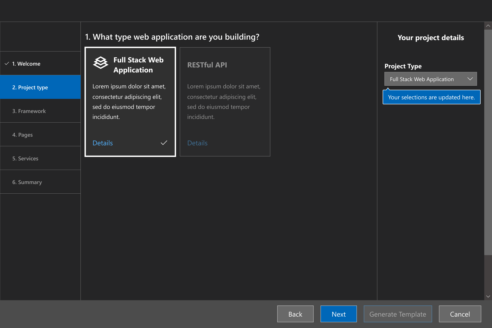

# Web Template Studio
Web Template Studio (WebTS) is a Visual Studio Code Extension that accelerates the creation of new Web apps using a wizard-based experience. The resulting Web application is well-formed, readable code that
incorporates cloud services on Azure while implementing proven patterns and best practices. Sprinkled throughout the generated code we have links to Docs to provide useful insights. 

WebTS currently supports the following:

- Front-end: React.js
- Back-end: Node.js
- Cloud services: Cosmos DB, Azure Functions

*Example Scenario*: I need a Fullstack web app that stores blog posts in a Cosmos database.



## Features

Web Template Studio approaches web app creation using the following four attribute sets:

* **Project type**: First, what type of application are you building? We currently support one type: *Fullstack Application*.
* **Frameworks**: Next, which frameworks do you want to use for your frontend and backend? We currently support one framework for frontend: *[React.js](https://reactjs.org/)* and one framework for backend: *[Node.js](https://nodejs.org/en/)*.
* **App pages**: To accelerate app creation, we provide a number of app page templates that you can use to add common UI pages into your new app. The current page templates include: *blank page*, common layouts (*e.g., master/detail) and pages that implement common patterns (*e.g., grid, list). Using the wizard, add as many of the pages as you need, providing a name for each one, and we'll generate them for you.
* **Cloud Services**: Lastly, you specify which Azure cloud services you want to use, and we'll build out the framework for the services into your app including tagging 'TODO' items. Currently supported services cover storage (*Azure Cosmos DB*), and compute (*Azure Functions*).

Once you make the selections you want and click generate, you can quickly extend the generated code.

Note: Use VSCode light mode to view the extension. Running the extension in VSCode v1.31 ~~and above will currently result in non-rendering SVGs~~. This issue was [fixed on Feb.12, 2019](https://github.com/Microsoft/vscode/issues/68033).

# Prerequisites
[Git](https://git-scm.com/downloads), [Yarn](https://yarnpkg.com/en/docs/install#mac-stable), [Node.js](https://nodejs.org/en/download/) and [VSCode](https://code.visualstudio.com/updates/v1_31) must be installed prior to running the installation or build scripts.

In VSCode, install the [Azure Cosmos DB VSCode extension](https://marketplace.visualstudio.com/items?itemName=ms-azuretools.vscode-cosmosdb) because it is an extension dependency.

Install [Visual Studio Code Extensions CLI](https://code.visualstudio.com/api/working-with-extensions/publishing-extension#vsce) using the command `yarn add global vsce`.

Run the command 
```
npm config set scripts-prepend-node-path true
```
to tell VSCode which Node version to run during the extension compilation (otherwise you'll get an error during the build process).

*If using Windows, use Git Bash*.

# Development Quick Start
Clone the repository and use (for Windows)
```
./build
```
to install dependencies, compile the client and the extension. Open `src/extension` using `VSCode` and press `F5` to run the extension. Use `Ctrl+Shift+P` to open VSCode's extension CLI and open the extension named `Web Template Studio`.

if compiling on Mac, try:
```
bash build
```

## Developing for the Client
The client lives in the `src/client` directory. To run the client for development, navigate to `src/client` and use the command
```
yarn start
```
to begin development. The client was bootstrapped using [Create-React-App with TypeScript](https://facebook.github.io/create-react-app/docs/adding-typescript).

# Create VSIX Package for Sideloading

**EXCLAIMER: You cannot sideload the VSIX and build/run the extension through Extension Development Host (using `F5` on VSCode) at the same time or there will be naming conflicts. The VSIX should be uninstalled first.**

The installation script "createVsix" will build and install the extension for you. Use the command on Windows:
```
./createVsix
```
For Mac, use:
```
bash createVsix
```
to avoid setting permissions for the script.

The script will package the extension into the root directory `/dist` folder. The vsix package can be distributed and installed by anyone who has VSCode using the command in the extension directory:
```
code --install-extension [extensionName].vsix
```
`wts.vsix` is the default extensionName.

Alternatively, copy the extension into your extensions directory. For Windows, it is `%USERPROFILE%\.vscode\extensions`. For Mac/Linux, it is  `~/.vscode/extensions` (By Default). 

After installation, use `ctrl+shift+p (Windows)` or `cmd+shift+p (Mac)` to open the Extension Launcher and select `Web Template Studio: Launch` to run the extension.

**Note: Use VSCode light mode for proper viewing**

## Creating an installation alias (optional)
Create an alias in your `.bashrc` file to run the extension more conveniently. For example:

```
1. Use vim ~/.bashrc to open the bashrc file (any text editor will do as long as you know the location).
2. Add the following line:

alias cv="./createVsix || bash createVsix"

3. Save the .bashrc file and quit Vim.
4. Use the command "source ~/.bashrc" to load the alias.
```

You can simply use the command `cv` (or change to your liking) to run the build script onwards.

## Running the client in the VSCode Extension


To see any changes made on the client within VSCode, run the instructions shown in the `Quick Start` section to rebuild the client and the extension. The resulting changes should appear in VSCode when the extension runs.

Rebuilding the client is required because the client is injected into a [VSCode Webview](https://code.visualstudio.com/api/extension-guides/webview) using the production build of the client.

# Under the Hood
The following notes are inspired by the [vscode-webview-react](https://github.com/rebornix/vscode-webview-react) repository by [rebornix](https://github.com/rebornix):

- We inline `index.html` content in `src/extension/src/extension.ts` when creating the webview
- For all resources going to the webview, their scheme is `vscode-resource`
- We add a baseUrl `<base href="${vscode.Uri.file(path.join(this._extensionPath, 'build')).with({ scheme: 'vscode-resource' })}/">` and then all relative paths work.

# Contributing

This project welcomes contributions and suggestions.  Most contributions require you to agree to a
Contributor License Agreement *(CLA) declaring that you have the right to, and actually do, grant us
the rights to use your contribution. For details, visit https://cla.microsoft.com.

When you submit a pull request, a CLA-bot will automatically determine whether you need to provide
a CLA and decorate the PR appropriately (e.g., label, comment). Simply follow the instructions
provided by the bot. You will only need to do this once across all repos using our CLA.

This project has adopted the [Microsoft Open Source Code of Conduct](https://opensource.microsoft.com/codeofconduct/).
For more information see the [Code of Conduct FAQ](https://opensource.microsoft.com/codeofconduct/faq/) or
contact [opencode@microsoft.com](mailto:opencode@microsoft.com) with any additional questions or comments.
