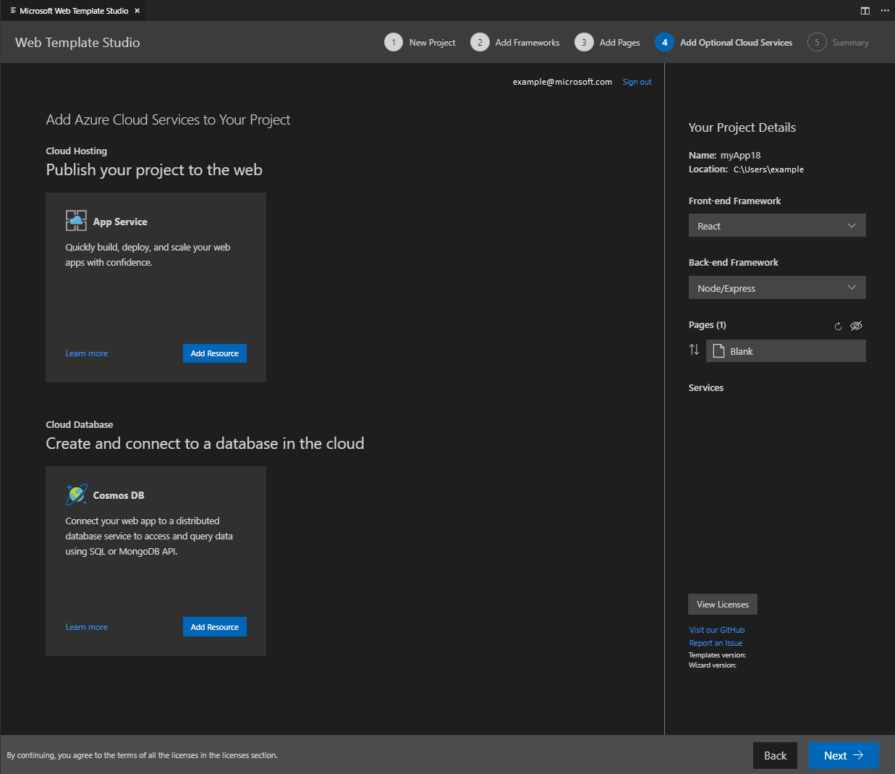

# Microsoft Web Template Studio

   

Microsoft *Web Template Studio* (aka *WebTS*) is a Visual Studio Code Extension that accelerates the creation of a new **Web or React Native** application using a wizard-based experience.

*WebTS* enables developers to generate boilerplate code for a **Web or React Native** application by choosing between different project types, frontend and backend frameworks, pages and cloud services.
The resulting app is well-formed, readable code. The web application incorporates cloud services on
Azure while implementing proven patterns and best practices. Sprinkled throughout the generated code we have links to
Docs to provide useful insights. *WebTS* was created using TypeScript and React. Different combinations of generated code
are merged together by [Core Template Studio](https://github.com/Microsoft/CoreTemplateStudio), which was made using .NET Core.

## Build Status

| Branch  |                                                                                                                Build Status                                                                                                                 |
| :------ | :-----------------------------------------------------------------------------------------------------------------------------------------------------------------------------------------------------------------------------------------: |
| dev     |        |
| release |       |

## Documentation
Detailed *Web Template Studio* (*WebTS*) documentation is [here](./docs/README.md).

## SHA256

Visual Studio Code extensions are currently not signed. *WebTS* provides the Secure Hash Algorithm (SHA) of each version we publish. You can find the current extensions sha256 value in the following files:

- [sha256-release.md](sha256-release.md)

To verify the integrity of the package, download the `vsix` from the Marketplace, calculate the hash of the package using the powershell command `Get-FileHash` or any other tool that allows you to calculate the packages hash, and compare both.

## Instructions To Use

### Create a new project

- Open **VSCode**
- Press `Ctrl + Shift ⇧ + P` in Windows/Linux or `Command ⌘ + Shift ⇧ + P` in Mac to open VSCode's extension launcher
- Type/Select `Web Template Studio: Create Web App` for a full-stack web application or `Web Template Studio: Create React Native App` for a React Native one, and press `Enter` to launch the extension

**Note**: React Native is still in Preview and we appreciate any feedback on [GitHub](https://github.com/microsoft/WebTemplateStudio/issues).

### Deploy the generated project

- Open **VSCode**
- Open the generated project
- Press `Ctrl + Shift ⇧ + P` in Windows/Linux or `Command ⌘ + Shift ⇧ + P` in Mac to open VSCode's extension launcher
- Type/Select `Web Template Studio: Deploy Web App` and press `Enter` to begin the deployment
**Note**: Just available for web applications.

## Example Scenario

### 1. Scenario 1
 I need a full-stack web app that is deployed on Azure App Service Web App.

### 2. Scenario 2
I want to create a react native app that works for Android, iOS and Windows. I want my App to have a master-detail and a settings page, that allows the users to switch the App's theme.

## Features

*Web Template Studio* approaches full-stack web app creation using the following three attribute sets:

- **Frameworks**: First, which frameworks do you want to use for your frontend and backend? We currently support three frameworks for frontend: _[React](https://reactjs.org/)_, _[Angular](https://angular.io/)_, _[Vue.js](https://vuejs.org/)_ and four frameworks for backend: _[Node](https://nodejs.org/en/)_, _[Flask](http://flask.pocoo.org/)_,  _[Moleculer](https://moleculer.services/)_ and _[ASP.NET Core](https://dotnet.microsoft.com/apps/aspnet)_. We also provide a dependency checker to make sure you have the required version of Node, Python and/or .NET Core installed.
- **App pages**: Next, to accelerate app creation, we provide a number of app page templates that you can use to add common UI pages into your new app. The current page templates include: _blank page_, common layouts (*e.g., master detail) and pages that implement common patterns (*e.g., grid, list). Using the wizard, add as many of the pages as you need, providing a name for each one, and we'll generate them for you.
- **Cloud Services**: Lastly, you specify which Azure cloud services you want to use, and we'll build out the framework for the services into your app. Currently supported services cover storage (_Azure Cosmos DB_), and hosting (_Azure App Service_).

Once you make the selections you want and click generate, you can quickly extend the generated code.

## Known Issues
### React Native Applications
#### 1. Generated App has some lint errors.
As a workaround you just need to run `yarn lint --fix`. There´s already an issue to fix [this](https://github.com/microsoft/WebTemplateStudio/issues/1769).
#### 2. React Native Windows.
- Update to 0.64: Bottom tab navigation doesn´t change text colour when selected. There´s [an issue](https://github.com/microsoft/react-native-windows/issues/7560) in React Native Windows to fix this in version 0.65.
- Bundle targets fail when path contains spaces. There´s [an issue](https://github.com/microsoft/react-native-windows/issues/7597) in React Native Windows to fix this in version 0.65.

## Feedback, Requests and Roadmap

Please use [GitHub issues](https://github.com/Microsoft/WebTemplateStudio/issues) for feedback, questions or comments.

If you have specific feature requests or would like to vote on what others are recommending, please go to the [GitHub issues](https://github.com/Microsoft/WebTemplateStudio/issues) section as well. We would love to see what you are thinking.

We are still early in development and are looking for [feedback](https://github.com/Microsoft/WebTemplateStudio/issues) for the roadmap. We're still working on polishing our Web Templates and in our latest version we've also added an initial version of React Native templates.

## Contributing

Do you want to contribute? We would love to have you help out. Here are our [contribution guidelines](CONTRIBUTING.md).

## Reporting Security Issues

Security issues and bugs should be reported privately, via email, to the Microsoft Security Response Center (MSRC) at secure@microsoft.com. You should receive a response within 24 hours. If for some reason you do not, please follow up via email to ensure we received your original message. Further information, including the MSRC PGP key, can be found in the Security TechCenter.

## License

This code is distributed under the terms and conditions of the [MIT license](LICENSE.md).

## Privacy Statement

The extension does [log basic telemetry](./docs/telemetry.md) for what is being selected. We are in the process of creating a [Telemetry Data](./docs/telemetryData.md) page to summarize usage trends. Please read the [Microsoft privacy statement](http://go.microsoft.com/fwlink/?LinkId=521839) for more information.

## Frameworks in Generated Code Not Created by Our Team

- [React](https://reactjs.org/)
- [Create-React-App](https://github.com/facebook/create-react-app)
- [Express](https://expressjs.com/)
- [Express Generator](https://expressjs.com/en/starter/generator.html)
- [Bootstrap](https://getbootstrap.com/)
- [Angular](https://angular.io/)
- [Angular CLI](https://angular.io/cli)
- [Vue](https://vuejs.org/)
- [Vue CLI](https://cli.vuejs.org/)
- [Node.js](https://nodejs.org/en/)
- [Flask](http://flask.pocoo.org/)
- [Moleculer](https://moleculer.services)
- [ASP.NET](https://dotnet.microsoft.com/apps/aspnet)
- [React Native](https://reactnative.dev/)
- [React Native for Windows](https://microsoft.github.io/react-native-windows/)

## Acknowledgments

Microsoft *Web Template Studio* was [initially created by Microsoft Garage interns](./docs/acknowledgments.md). We hope many more continue with the project.
