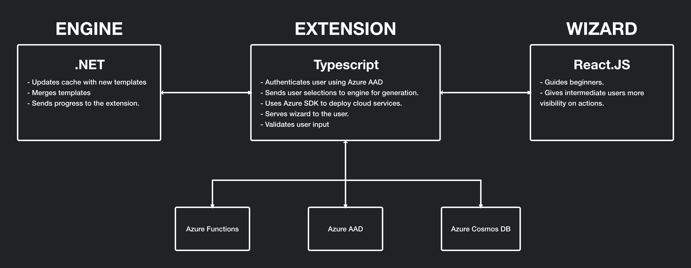

Web Template Studio is a [Visual Studio Code Extension](https://code.visualstudio.com/api) built in [Typescript](https://www.typescriptlang.org/)/[React.js](https://reactjs.org/). It leverages the templating engine ([Core Template Studio](https://github.com/Microsoft/CoreTemplateStudio)) used by [Windows Template Studio](https://github.com/Microsoft/WindowsTemplateStudio). For more info on the terminology, please refer to the [terminology document](./terminology.md).

[Core Template Studio](https://github.com/Microsoft/CoreTemplateStudio) serves both Web and Windows Template Studios in merging the templates selected by the user. For more information on Core Template Studio, refer to its [documentation](https://github.com/Microsoft/CoreTemplateStudio/blob/dev/docs/getting-started-developers.md).

[Web Template Studio](https://github.com/Microsoft/WebTemplateStudio) has two major components. The extension's backend (referred to as the [extension](https://github.com/Microsoft/WebTemplateStudio/tree/dev/src/extension)), which is written in [Typescript](https://www.typescriptlang.org/) and the front-end wizard (referred to as the [client](https://github.com/Microsoft/WebTemplateStudio/tree/dev/src/client)), written in [React.tsx](https://www.typescriptlang.org/docs/handbook/jsx.html).

Here is a diagram that illustrates the high level functionality of each of the components:



Before the extension is ready to run, the build script compiles the wizard's React code into JavaScript that gets injected into html, which then gets served using [VSCode's Webview API](https://code.visualstudio.com/api/extension-guides/webview). Visit [this page](https://github.com/Microsoft/WebTemplateStudio/blob/dev/docs/install.md) to know more about how to run the extension. As the extension is launching, it starts up the Engine (which will by default run on PORT 9502) and updates the cache with the updated templates (if any were added). The Engine will keep listening to the extension's requests such as generation, etc.

The two components will be discussed separately later. There are a few important concepts that will help you get started on development quickly:

## **Communication**

The wizard runs in an isolated environment, and mimics how applications run on a browser. For example, the wizard does not have access to the local storage of the user, or any of the OS's resources/actions. For this reason, most of the logic is done in the extension. The wizard communicates with the extension using the WebView API, with a command defined for each function (look at the extension's constants file and the wizard's constants file to see the currently defined commands).
For example, if we want to send the email of a user from the extension to the wizard, you can use the VSCode object to do so:

```js
vscode.postMessage({
  command: "sendEmailCommand",
  payload: {
    email: "example@email.com"
  }
});
```

        This sends the email using the WebView API and

```js
panel.webview.onDidReceiveMessage(
  message => {
    switch (message.command) {
      case "sendEmailCommand":
        // message.payload.email = example@email.com
        return;
      // other commands
    }
  },
  undefined,
  undefined
);
```

    receives the email.

We receive all the commands from the extension in [App.tsx](https://github.com/Microsoft/WebTemplateStudio/blob/dev/src/client/src/App.tsx) and receive all the commands from the wizard in the [controller.ts](https://github.com/Microsoft/WebTemplateStudio/blob/dev/src/extension/src/controller.ts). You will find the documentation very helpful if you need more info on the Webview API.

## **Separating the UI from the Logic**:

One of our main concerns is increasing the speed of the wizard and making it as light as possible. Therefore, the wizard does not perform any expensive computations, and does not make any API requests. Most of these actions are done in the extension. So as the user navigates through the wizard, the selections are validated in the wizard and stored. When the user clicks generate, these selections will then be sent to the extension, which will deal with them synchronously. The extension starts with the templates (if any were selected), which will get sent to the Engine (Core Template Studio). After their successful generation, the extension uses Azure SDK to deploy the resources if the user selects any.

We will briefly discuss the architecture of the extension and the wizard:

## **Client**:

As previously mentioned, the client is written in React.js. It keeps track of the state using Redux. If you are not familiar with Redux, we suggest familiarizing yourself with it before you start development on the wizard.

## **Extension**:

TODO: Explain the architecture of the extension and the key concepts to contribute.
The extension back-end is responsible for running all services pertaining to the core experience. This includes launching the VS Code WebView React Panel, hosting the core template generation engine and enabling functionality with the Azure Cloud Computing Platform.

To communicate with the user-facing React Wizard, VS Code extension API exposes the `PostMessage()` function to communicate with the extension and vice versa. The behavior of a received message from the wizard is defined in a function delegate that gets passed to the ReactPanel from the controller.

The controller acts as a router to and for behavior. The flow of command from client starts when the `postMessage()` gets called in the client and the reactpanel object in the extension receives it. With the argument payload `message: any` from the client, there is a property specified within message called `module`. This tells the controller which service module the message payload should be routed to. 

For more details about how to make specific contributions to the project (adding templates, services, etc.) please refer to the [FAQ](./faq.md) section.
