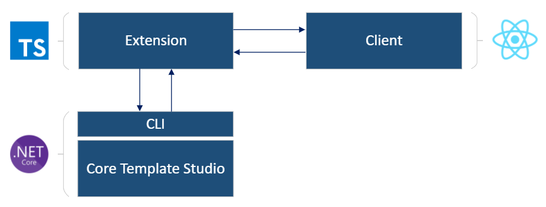

Web Template Studio is a [Visual Studio Code Extension](https://code.visualstudio.com/api) that has three major components: 

  - The extension's backend (referred to as the [extension](https://github.com/Microsoft/WebTemplateStudio/tree/dev/src/extension)), which is written in [Typescript](https://www.typescriptlang.org/).
  -  The front-end wizard (referred to as the [client](https://github.com/Microsoft/WebTemplateStudio/tree/dev/src/client)), written in [React](https://reactjs.org/) and [Typescript](https://www.typescriptlang.org/).
  - Generation engine (referred to as [Core Template Studio](https://github.com/Microsoft/CoreTemplateStudio)) written in [.NET Core](https://dotnet.microsoft.com/download). 
  


All three components are included in Web Template Studio vsix.

## Extension

The extension is the main part of Web Template Studio. It has been built using the [Visual Studio Code Extensibility API](https://code.visualstudio.com/api) to build extensions. It is responsible for launching the client in a Visual Studio Code tab and for communication between the wizard client and the Core Template Studio CLI. It is also responsible for creating the Azure Services (App Service and CosmosDB Service) and the deployment the generated applications.

It contains two commands that can be called from Visual Studio Code:

- [webTemplateStudioExtension.wizardLaunch](https://github.com/microsoft/WebTemplateStudio/blob/dev/src/extension/src/extension.ts#L7-L11): This command is executed when we launch the "Web Template Studio: Launch" command from Visual Studio Code. It is responsible to start the Core Template Studio CLI in a `child_process`, synchronizing the templates and opening the wizard in a Visual Studio Code tab. While the wizard is open, it is also responsible for maintaining communication between the wizard client and the Core Template Studio CLI to obtain templates and generate projects.
  
- [webTemplateStudioExtension.deployApp](https://github.com/microsoft/WebTemplateStudio/blob/dev/src/extension/src/extension.ts#L13-L18): This command is executed when we launch the "Web Template Studio: Deploy App" command from Visual Studio Code. It is responsible for deploying a generated application in Azure. Note: For this command to work properly, we need a web application generated with Web Template Studio opened and configured with an App Service.


## Client

The wizard client is the visual component of the extension. It is a [React](https://reactjs.org/) app that is compiled into JavaScript that gets injected into html, which then gets served using [VSCode's Webview API](https://code.visualstudio.com/api/extension-guides/webview). It is shown in a Visual Studio Code tab when the user executes the "Web Template Studio: Launch" extension command.

It is responsible for the interaction with the user and is responsible for collecting the name and route of the project, the selected frameworks, pages and services and sending them to the extension for processing with Core Template Studio.

The wizard client keeps track of the state using [Redux](https://react-redux.js.org/).

## Generation Engine (Core Template Studio)

The Generation Engine is responsible for template synchronisation, get frameworks, get templates and generating projects. It consists of a [CLI](https://github.com/microsoft/CoreTemplateStudio/blob/dev/docs/getting-started-developers.md#cli-project) that receives requests from the extension and get processed by [Core Template Studio](https://github.com/microsoft/CoreTemplateStudio/). Once the request is processed, it returns the response in json format to the extension.

For more Info see [Core Template Studio Docs](https://github.com/microsoft/CoreTemplateStudio/blob/dev/docs/getting-started-developers.md).


## Extension and CLI Core Template Studio communication

The communication between the extension and the Core Template Studio CLI is defined in the [coreTemplateStudio.ts](https://github.com/microsoft/WebTemplateStudio/blob/dev/src/extension/src/coreTemplateStudio.ts) file. This static class is responsible for starting/stopping the Core Template Studio CLI in a `child_process`, and managing the Core Template Studio CLI requests and responses (including notifications and errors). 

It also exposes public functions to call the Core Template Studio CLI commands. Currently the functions offered by the [coreTemplateStudio](https://github.com/microsoft/WebTemplateStudio/blob/dev/src/extension/src/coreTemplateStudio.ts) class are:

```js
- sync(payload: ICommandPayload): Promise<any>
- getProjectTypes(): Promise<any>
- getFrameworks(projectType: string): Promise<any>
- getPages(projectType: string, frontendFramework: string, backendFramework: string): Promise<any>
- getFeatures(projectType: string, frontendFramework: string, backendFramework: string): Promise<any>
- generate(payload: ICommandPayload): Promise<any>
```

To execute a Core Template Studio CLI command from the extension we have to instantiate the [coreTemplateStudio](https://github.com/microsoft/WebTemplateStudio/blob/dev/src/extension/src/coreTemplateStudio.ts) class and execute the function that has the command we want to execute.

 Example:

```js
async getPages(): Promise<void> {
    const coreTS = CoreTemplateStudio.GetExistingInstance();
    const pages = await coreTS.getPages("projectType", "frontendFramework", "backendFramework");
    console.log(pages);
    };
  }
```

To see the Core Template Studio CLI available commands visit [Core Template Studio Docs](https://github.com/microsoft/CoreTemplateStudio/blob/dev/docs/getting-started-developers.md#cli-project).

## Extension and client communication

### Client send to extension

When the client wants to execute an extension command, it will call `vscode.postMessage()` function, passing through parameters an object with the following properties:

- module: extension module that should process this request.
- command: extension command that should process the request.
- payload: data that we send in the request.

 Example:

```js
vscode.postMessage({
        module: "extension-module",
        command: "get-pages",
        payload: {
          projectType: "project type",
          frontendFramework: "frontend framework",
          backendFramework: "backend framework"
        }
      });
```

When the extension create the webview (that includes the client), the `routingMessageReceieverDelegate()` function found in [controller.ts](https://github.com/microsoft/WebTemplateStudio/blob/dev/src/extension/src/controller.ts) is passed by parameters. This function is responsible for receiving client requests and locating the module that processes the request. All modules that can process customer requests are registered in [Controller.extensionModuleMap](https://github.com/microsoft/WebTemplateStudio/blob/dev/src/extension/src/controller.ts#L50-L61).

The modules inherit from [WizardServant](https://github.com/microsoft/WebTemplateStudio/blob/dev/src/extension/src/wizardServant.ts) which is the class responsible for executing the function associated with each command, controlling errors and recording telemetry if necessary.

NOTE: In the development environment (running the app in the browser), the Visual Studio Code extension is not available for the client to interact with. The communication is mocked using the [mockVsCodeAPI.ts](https://github.com/microsoft/WebTemplateStudio/blob/dev/src/client/src/mockData/mockVsCodeApi.ts), which uses the native `window.postMessage()` command to send messages to the application.

### Client receive from extension

Messages sent from the extension are received in the `messageEventsFromExtension()` function in  [App.tsx](https://github.com/microsoft/WebTemplateStudio/blob/dev/src/client/src/App.tsx). This function configures an `addEventListener` to listen all messages sent from the extension and through a switch executes the necessary instructions according to the command received.

Example:

```js
 function messageEventsFromExtension(){
    window.addEventListener("message", event => {
      const message = event.data;
      switch (message.command) {
        ...
        case "get-pages":
          // set pages in redux store
          break;
        ...
      }
    }
 }
```

NOTE: currently, we are developing [extensionService.ts](https://github.com/microsoft/WebTemplateStudio/blob/dev/src/client/src/utils/extensionService/extensionService.ts) that will handle communication between client and extension through promises and will offer a simple and centralized way to call extension commands and receive responses.

### Extension to client

When the extension needs to send a request to the client, it will call `postMessageWebview()` function in [reactPanel.ts](https://github.com/microsoft/WebTemplateStudio/blob/dev/src/extension/src/reactPanel.ts). This function communicates with the webview (that contains the client), passing through parameters an object with the following properties:

- command: extension command that processed the request.
- payload: data that we send in the request.

Example:

```js
reactPanelContext.postMessageWebview({
      command: "get-template-info",
      payload: {
        templatesVersion:"1.0.0.0",
        wizardVersion: "1.0.0.0",
        itemNameValidationConfig: [],
        projectNameValidationConfig: []
      }
```


## Separating the UI from the Logic:

One of our main concerns is increasing the speed of the wizard and making it as light as possible. Therefore, the wizard does not perform any expensive computations, and does not make any API requests. Most of these actions are done in the extension. So as the user navigates through the wizard, the selections are validated in the wizard and stored. When the user clicks generate, these selections will then be sent to the extension, which will deal with them synchronously. The extension starts with the templates (if any were selected), which will get sent to the Engine (Core Template Studio). After their successful generation, the extension uses Azure SDK to deploy the resources if the user selects any.
