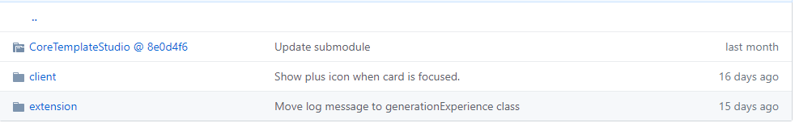

# Getting started developers
To contribute to *Web Template Studio*.

If you are authoring templates for *Web Template Studio*, or interested in contributing to this repo, then you are likely interested in how to use the latest version of this code.

This document covers:
- [Prerequisites](#prerequisites)
- [Project folder structure](#project-folder-structure)
- [Core Template Studio Submodule](#core-template-studio-submodule)
- [How to run the extension locally](#how-to-run-the-extension-locally)
- [How to develop the client](#how-to-develop-the-client)
- [How to built a local vsix](#how-to-built-a-local-vsix)
- [Tests](#tests)
- [Under the hood](#under-the-hood)

Before starting make sure you read the [Web Template Studio arquitecture](application-architecture.md) document.

If you just want to take advantage from *Web Template Studio* extension, check the [Web Template Studio Installation Instructions page](../install.md).

## Prerequisites

1. Install [Node.js](https://nodejs.org/en/download/)
1. Install [Gulp](https://gulpjs.com/)
1. Install [Git](https://git-scm.com/downloads)
1. Install [.NET Core SDK](https://dotnet.microsoft.com/download/dotnet-core/3.1)
1. Install [Visual Studio Code](https://code.visualstudio.com/)
1. Install [Yarn](https://yarnpkg.com/en/docs/install). You will need to finish installing Node.js before you install Yarn.
1. Run the command `npm config set scripts-prepend-node-path true`. This tells VSCode which Node version to run during the extension compilation (otherwise you'll get an error during the build process).

**Note**: If using Windows, use Git Bash. 

At some point you may also need to install [React-scripts](https://yarnpkg.com/package/react-scripts) and [Typescript](https://www.typescriptlang.org/).

## Project folder structure

### `src` folder
This folder contains the source code for the different components of *Web Template Studio*.

- [`client`](../../src/client): This folder contains the client or wizard code.
    - `src`:
        - `assets`: contains all the SVGs used for the frontend.
        - `components`: contains all React components that are reusable.
        - `css`: CSS contains styling that is global.
        - `mockData`: mocked data to be able to use from the browser while developing.
        - `modals`: React components and its subcomponents displayed as modals.
        - `pages`:  React components and its subcomponents displayed as main pages on the Wizard.
        - `store`: contains reducers, actions, interfaces and selectors for the Redux store.
        - `utils`: contains helper functions, constants and others.
        *For example*: validation, routes and extensionService.
            - `extensionService`: allows client-extension communication.


- [`extension`](../../src/extension): This folder contains the Visual Studio extensions code.
    - `src`:
        - `azure`: contains all functionality related to azure services.
        - `client-modules`: contains the client-modules that allow client-extension communication.
        - `telemetry`: contains all functionality related to telemetry.
        - `utils`: contains helper functions as logger and validators.

- `CoreTemplateStudio`: This solution contains the Core Template Studio code.

For more information on internal structure, see [Core Template Studio docs](https://github.com/microsoft/CoreTemplateStudio/blob/dev/docs/getting-started-developers.md).

### `_build` folder
This folder contains scripts for local development and usage from the build pipeline.

### `dist` folder
This folder will contain the .vsix if generated.

### `templates` folder
This folder contains the templates that are used to generate the code. For more info on templates see [Understanding the Templates](templates.md).

### `template-test` folder
This folder will contain all the combination of possible generated applications when running the script "**template-tests**" existing on the extension.

## Core Template Studio Submodule
*Web Template Studio* relies on Core Template Studio for template synchronization and template composition, generation and postaction. Core Template Studio has its [own Github repository](https://github.com/Microsoft/CoreTemplateStudio) as it is shared with the sibling project [Windows Template Studio](https://github.com/Microsoft/WindowsTemplateStudio).

Core Template Studio is integrated into *Web Template Studio* using a git submodule under the folder `/src/CoreTemplateStudio`. The submodule points to a specific commit in Core Template Studio, that you can see in github:



### Init /update
When you clone *Web Template Studio* you have to run two commands: `git submodule init` and `git submodule update` to fetch all the data from Core Template Studio. When fetching changes, also execute `git submodule update` after doing git fetch to be sure you're submodule is up to date.

### Update with remote changes
Changes on Core Template Studio should be done on the Core Template Studio repos. In WebTS, to update the submodule to the most recent commit, you have to run the command: `git submodule update --remote`.

## How to run the extension locally
1. Run `./build-all.sh` from the `_build` folder. This script installs dependencies and compiles the client and core template studio and copies it to the extension. It also builds and installs the extension. 

    There are also separate scripts:
    - For building the client (`build-client.sh`).
    - For the Core Template Studio Cli (`build-coretscli.sh`).
    - For the extension (`build-extension.sh`).
2. Open the `src/extension` folder using `VSCode`.
3. Start the debugger by pressing `F5`. This should open the Extension Development Host in a new Visual Studio Code window.
4. In the Extension Development Host, press `Ctrl + Shift ⇧ + P` in Windows/Linux or `Command ⌘ + Shift ⇧ + P` in Mac to open the Command Palette.
5. In the Command Palette, type `Web Template Studio (local): Launch` and press `Enter` to launch the extension. We recently added concurrent installation support.
    - `Web Template Studio: Launch`: this would launch the marketplace version.
    - `Web Template Studio (nightly): Launch`: this would launch an installed instance of the extension.

## How to develop the client
As the client is injected as a static web app in the webview of the extension, debugging inside the extension can be challenging. Running the client in a browser is useful for quickly testing HTML or CSS changes and for debugging since you can use **Chrome extensions** such as `React and Redux developer tools`.

When running in the browser, communication with the extension is done against the mock `mockVsCodeApi.ts` in the `mockData` folder. Note that the behaviour of the client on the browser may differ from the behaviour in the extension, so make sure to test out both.
Styles are mocked in the Browser using the file [`mockThemes.css`](../../src/client/src/css/mockThemes.css).

1. Run `./build-client.sh` from the _build folder.
2. Open the `src/client` folder using `VSCode`.
3. Start the client using `yarn start` to begin development in the browser. We recommend using a chromium based browser such as Chrome.

#### More info:
- [React Developer Tools](https://chrome.google.com/webstore/detail/react-developer-tools/fmkadmapgofadopljbjfkapdkoienihi)
- [Redux Developer Tools](https://chrome.google.com/webstore/detail/redux-devtools/lmhkpmbekcpmknklioeibfkpmmfibljd)

### To debug from Visual Studio Code:
Install [Debugger for Chrome extension](https://marketplace.visualstudio.com/items?itemName=msjsdiag.debugger-for-chrome) in Visual Studio Code debug Wizard Client.
After starting the client using `yarn start` in VSCode Debug View (`Ctrl + Shift ⇧ + D` (Windows/Linux) or `Shift ⇧ + Command ⌘ + D` (Mac) in Visual Studio Code) select "*Debug WebTS Client*" and start debugging (`F5`).

#### More info:
- [Debugger for Chrome](https://marketplace.visualstudio.com/items?itemName=msjsdiag.debugger-for-chrome)
- [Debugging in Visual Studio Code](https://code.visualstudio.com/docs/editor/debugging)

## How to built a local vsix
Run `./createLocalVsix.sh` from the `_build` folder.

The script will compile the client, CoreTS (in release mode) and the extension and package the extension into the root directory `/dist` folder. The vsix package can be distributed and installed by anyone who has VSCode using the command in the extension directory:

```
code --install-extension [extensionName].vsix
```

`webts-0.0.0-UNTRACKEDVERSION.vsix` is the default extensionName.

Alternatively, the extension can be installed from the context menu of the extension section in Visual Studio code using the "**install from VSIX...**" command. The installed vsix package can be found in the extensions folder. For *Windows*, it is `%USERPROFILE%\.vscode\extensions`. For *Mac/Linux*, it is `~/.vscode/extensions` (By Default).

After installation, use `Ctrl + Shift ⇧ + P` (Windows/Linux) or `Command ⌘ + Shift ⇧ + P` (Mac) in Visual Studio Code to open the Extension Launcher and select `Web Template Studio: Launch` to run the extension.

## Tests

### Client Tests
Currently, we use *Jest and React Testing Library* for our unit tests which was set up by `create-react-app`.

To run the client tests, go to `src/client` and run `yarn test` to run all the tests. Running this execute tests in files that end with *.{spec,test}.{js,jsx,ts,tsx}.

#### More info:
- [Jest](https://jestjs.io/)
- [React Testing Library](https://testing-library.com/docs/react-testing-library/intro)

### Template Tests
Currently we use scripts to test the generated code. The scripts are located in [src/extension/src/scripts](../../src/extension/src/scripts).
The **generate-tests** script generates all the different permutations of a Fullstack project (without azure services).
Afterwards the **run-tests** script *installs the dependencies* for the generated project, runs *yarn start*, *yarn lint* and *yarn test* on all the generated projects.

To run the template tests go to the [`extension` folder](../../src/extension) and run `yarn template-tests` to run the tests.


## Under the Hood

The Architecture of this app was inspired by the [vscode-webview-react](https://github.com/rebornix/vscode-webview-react)

Find some notes about it below if you wish to get started with it:
repository by [rebornix](https://github.com/rebornix):

- We inline the initial html `<!DOCTYPE html> ... ` content in `src/extension/src/reactPanel.ts`  when creating the webview
- For all resources going to the webview, their scheme is `vscode-resource`
- We add a baseUrl `<base href="${vscode.Uri.file(path.join(this._extensionPath, 'build')).with({ scheme: 'vscode-resource' })}/">` and then all relative paths work.

## Learn more

- [All docs](../README.md)
