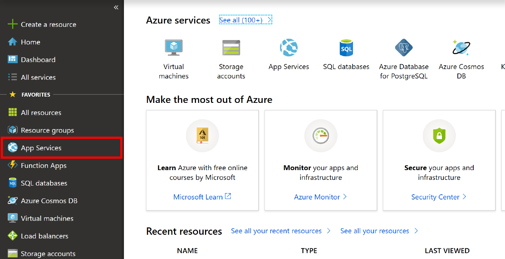
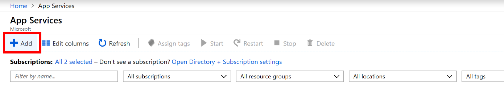

# Deployment

Once your business logic is implemented, we recommend that you deploy your website to the cloud so that your friends, family and customers can see.

## Azure App Service

One way to deploy is using Azure's App Service. App Service is Azure's platform as a service, which allows you to deploy and scale web, mobile and APIs. We also deploy our azure functions that we generate in WebTS to Azure App Service.

## Getting Started with Deployment

### VS code Extension Method

We highly recommend using the [vscode-azureappservice](https://github.com/Microsoft/vscode-azureappservice) extension.
You can learn all about deployment using their extension on their docs.

### Local Git Deployment Method

This method will require a lot more work on the user, but it won't require you to download another extension.

#### Creating the App Service

First you must head over to the [Azure Portal](https://portal.azure.com) and click on the App Services button.

Next, you must click on the Add button in the new window that appears.

