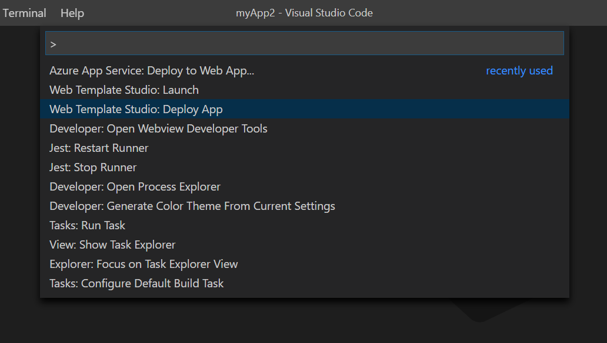
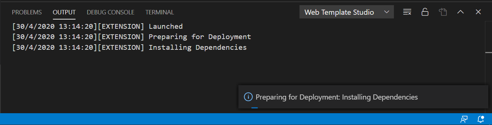
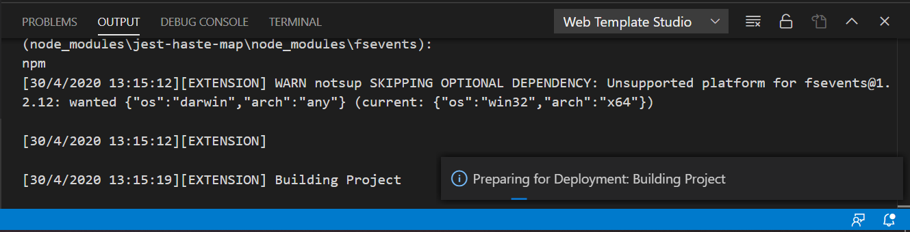
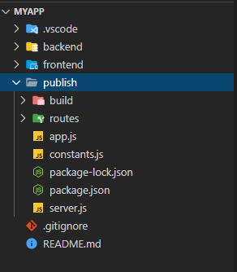
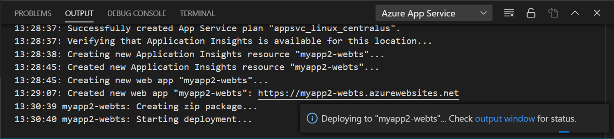
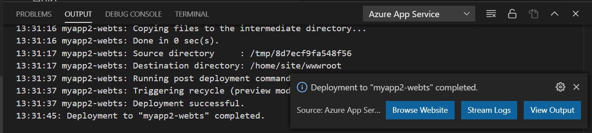

# Deployment

After implementing your business logic, we recommend deploying your website to the cloud.
Deploying your website to the cloud allows people to view your website by visiting a URL.

## Azure App Service

One way to deploy is using *Azure App Service*. This service will allow you to deploy and scale web, mobile and API apps.

## Web Template Studio: Deploy App command

**Note**: Make sure that the [Web Template Studio](https://marketplace.visualstudio.com/items?itemName=WASTeamAccount.WebTemplateStudio-dev-nightly) and [Azure App Service](https://marketplace.visualstudio.com/items?itemName=ms-azuretools.vscode-azureappservice) extensions are installed in Visual Studio Code.

The easiest way to deploy an application generated with *Web Template Studio* is to use the `Web Template Studio: Deploy Application` command. To execute this command, follow these steps:

1. Open the application generated with *Web Template Studio* in Visual Studio Code.

2. Press `Ctrl + Shift ⇧ + P` (Windows/Linux) or `Command ⌘ + Shift ⇧ + P` (Mac) to open the Command Palette.

3. In the Command Palette, type `Web Template Studio: Deploy App` and press `Enter` to launch the deploy.

*Web Template Studio* will begin preparing the application for deployment. You can see the progress in the Visual Studio Code output. In addition, a notification will be launched for each step executed.

It will run the tasks to install all the necessary dependencies for the frontend and the backend apps.

 

Create a Production Build: This step will creates a publish directory with a production build of your frontend and backend apps.

 

This folder will contain all the necessary frontend and backend files for the deployment.

 

*Web Template Studio* will then automatically launch the command `Azure App Service: Deploy to Web App...`, which will be in charge of deploying the application to an *Azure App Service*.

    - If you have added an *Azure App Service* when creating your application with *Web Template Studio*, the application already has a deployment configuration, so it will use the created *Azure App Service*.

    - Otherwise, the *Azure App Service* extension will ask you for the configuration settings to create a new *Azure App Service*:
      - The folder that contains the app to deploy to the App Service. Select the `publish` folder for deployment to be successful.
      - Select `Create New Web App...`
      - Enter your web app name
      - Select Linux as your OS
      - Select Node.js 12 LTS for a Node/Express application, Python 3.7 for a Flask application or .Net Core Latest runtime for ASP .NET application.

Start the application deployment to *Azure App Service*. We can see the progress of the deployment in the output of the *Azure App Service* extension.

 

At the end of the deployment, Visual Studio Code shows us a notification that the deployment has been successful.

 

### More info on Azure App Service and deployment:

- [Deploy the app to Azure](https://docs.microsoft.com/en-us/azure/app-service/app-service-web-get-started-nodejs#deploy-the-app-to-azure)
- [Azure App Service for Visual Studio Code](https://github.com/Microsoft/vscode-azureappservice)
- [Azure App Service documentation](https://docs.microsoft.com/en-us/azure/app-service/)

## Learn more

- [All docs](../README.md)