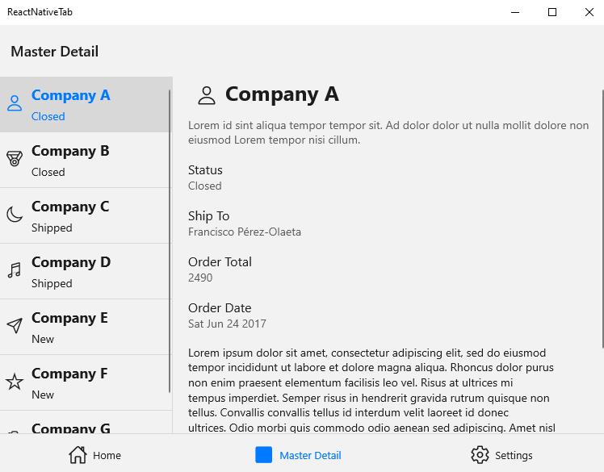
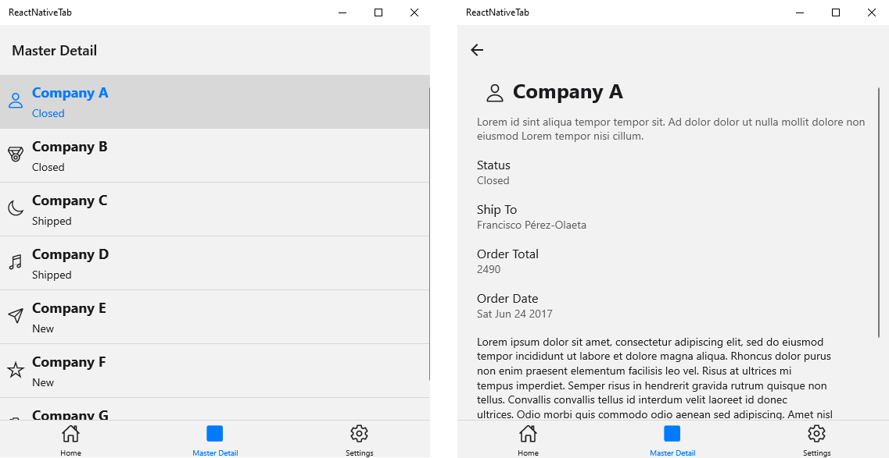
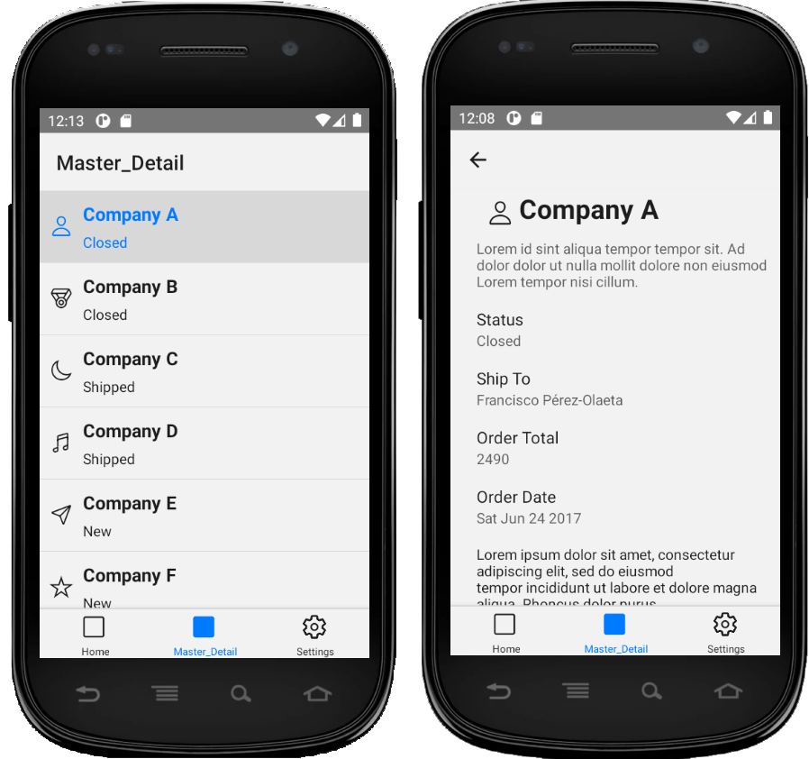
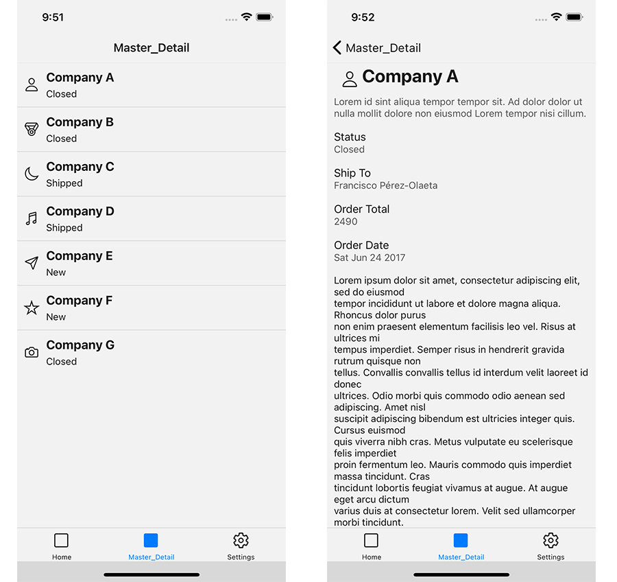

The master-detail page has a master pane and a details pane for content. When an item in the master list is selected, the details pane is updated. This pattern is frequently used for email and address books.

Currently, we set max width of 700dpi to have the list and the detail side by side on the page. When the screen is bigger, no matter the type of device, if the auto-rotate is ON the list would appear first and it would navigate to the item on click.

## Windows App

In smaller devices or if resized the application would look like this:

## Android App

## iOS App

