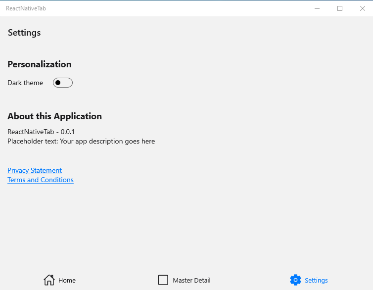
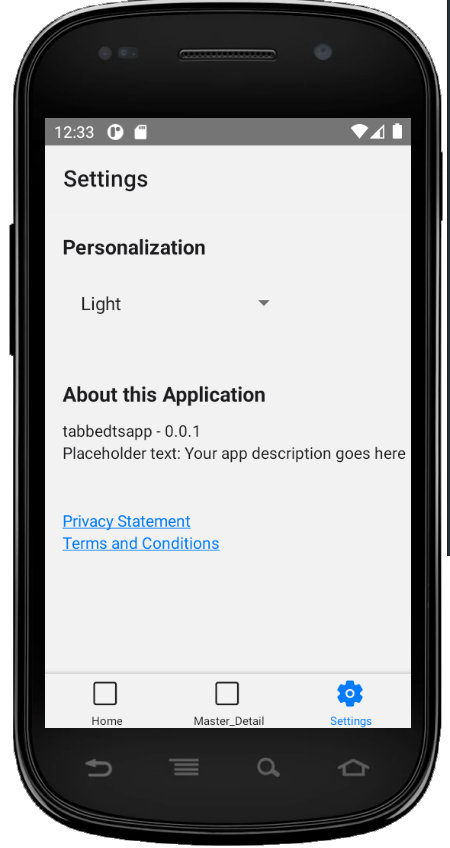
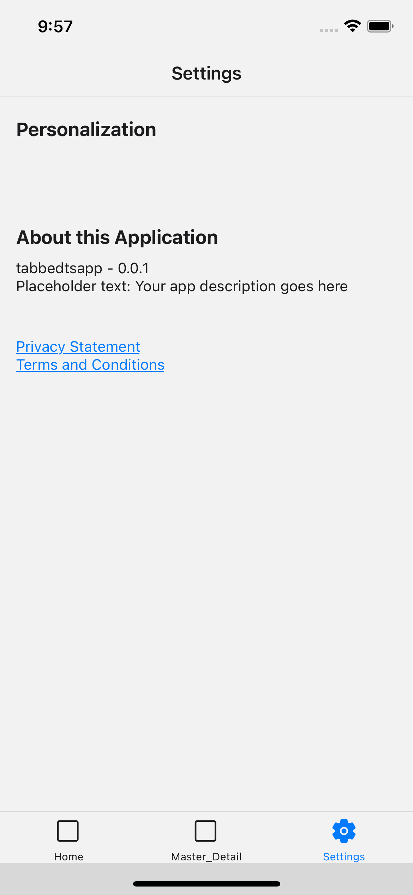

The settings page is the page where we recommend putting the configuration settings for your application such as setting a dark / light theme. This could also include any licenses, version number, and your privacy terms and conditions.

Currently this page provides the [Theme support](../features/theme-selection.md)

## Windows App

## Android App

## iOS App

