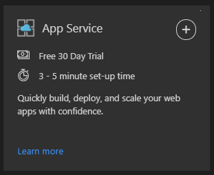
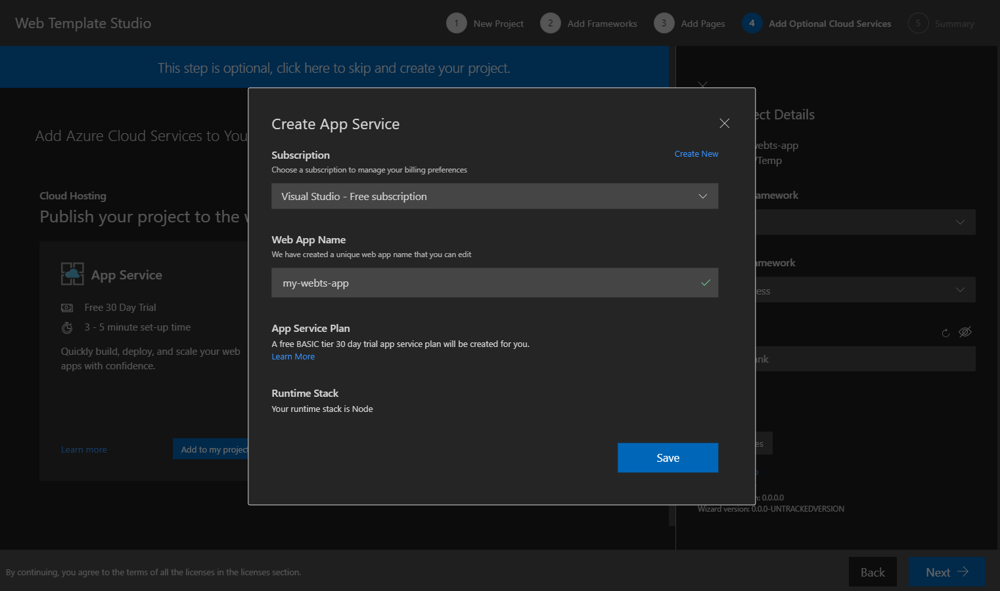
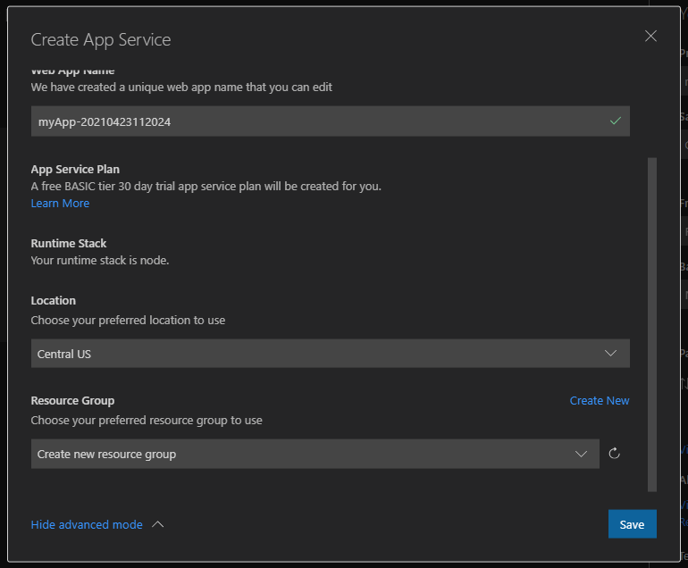

# Azure App Service

*Azure App Service* is an HTTP-based service for hosting web applications, REST APIs, and mobile backends. You can develop in your favorite language, be it .NET, .NET Core, Java, Ruby, Node.js, PHP, or Python. Applications run and scale with ease on both Windows and Linux-based environments. For more info about *Azure App Service* click [here](https://docs.microsoft.com/azure/app-service/overview).

*Web Template Studio* offers you the functionality to create and deploy your application to *Azure App Service* from the wizard quickly and easily.

## Getting started

To create an *Azure App Service* using *Web Template Studio*:

Navigate to the "**Add Optional Cloud Services**" step. Click the "**Add to my project**" button in the **App Service card**.

Select a **Subscription** from the **Create App Service** modal that just opened. Use the **Create New** option if you want to create a new *Subscription*. 

**Note**: **Create New** will take you to your Azure portal in the browser, so you can create a subscription.

Enter a **Web App Name** for your azure web app. It must be a unique app name that follows the Azure naming convention, for example it should include only the valid characters [a-z, A-Z, 0-9, and -]. Alternatively, you can accept the automatically generated unique name. The URL of the web app is `http://<app_name>.azurewebsites.net`, where `<app_name>` is your app name.

### Advanced mode

By default, *Web Template Studio* deploys the App Service in the location Central US and creates a Resource Group with the same name as the web app. It will also create the *free BASIC App Service Plan* that hosts the web app. [More info for App Service Plans](https://azure.microsoft.com/en-us/pricing/details/app-service/plans/).

We can change these settings using the *advanced mode*. To display it, click on the "**Advanced mode**" link and the App Service modal will show two new configuration options:

- **Location**: Azure region where the App Service will be deployed. Central US is selected by default. [More info about Azure Locations](https://azure.microsoft.com/en-us/global-infrastructure/regions/).

- **Resource Group**: A resource group is a container that holds related resources for an Azure solution. If we want to deploy the App Service in any resource group that you have created in the Azure Subscription previously, we can select it in the dropdown. If you don't select any resource group, it will be created in a new Resource Group with the same name as the web app.

## Creating App Service
Once you hit generate on the summary page, *Web Template Studio* will create an *Azure App Service* that will be accessible from `http://<app_name>.azurewebsites.net`.

*Web Template Studio* uses an arm-template for *Azure App Services* (generated under the arm-templates directory). This template contains the definitions and parameters for all resources that need to deploy. Once Azure receives your template, it takes about 2-3 minutes to create the App Service and the App Service Plan. The app service initially contains an empty web app.

**Note for advanced users**: The *arm templates* used to deploy your application, are also available under the *arm-templates* directory in your generated project.

## How to deploy

When we create a *Azure App Service*, it initially contains an empty web app. To learn how to deploy your generated application to the created *Azure App Service*, read the [Web Template Studio deployment documentation](../deployment.md).

## VSCode Extension for Azure App Service

To manage *Azure App Service* you can use the [Azure App Service extension for VS Code](https://marketplace.visualstudio.com/items?itemName=ms-azuretools.vscode-azureappservice), which is automatically installed with *Web Template Studio*.

This extension helps you create, manage, and deploy your websites quickly.
