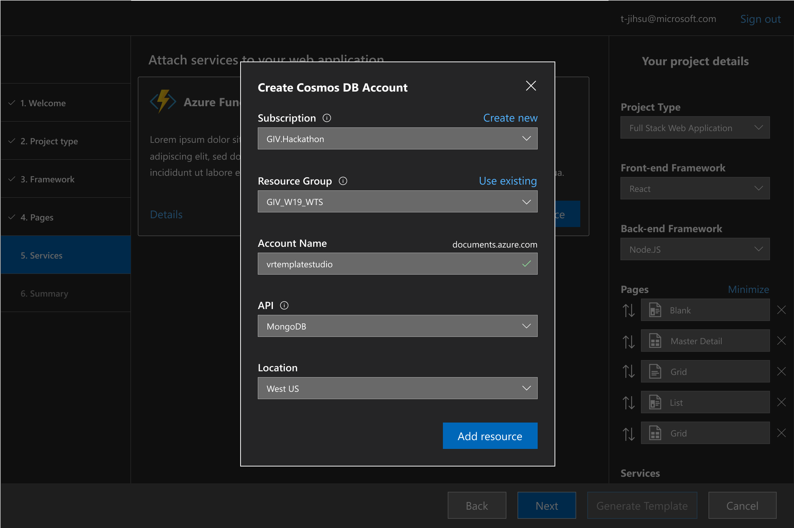

# Azure Cosmos DB

*Azure Cosmos DB* is Microsoft’s proprietary globally-distributed, multi-model database service for managing data on a
global scale. It offers a variety of APIs for your database including Azure Table, Core (SQL), MongoDB and Gremlin
(GraphQL).

*Web Template Studio* offers you the functionality to deploy a *Cosmos DB* instance from the wizard itself
and select an initial location to deploy your database with the ability to scale it to multiple locations at a future
time. As an added feature, deploying with the MongoDB API enables you to quickly connect the project *Web Template Studio*
generates to your database instance.

## Getting started

To deploy *Cosmos DB* using *Web Template Studio*:

Navigate to the "**Add Optional Cloud Services**" step. Click the "**Add to my project**" button in **CosmosDB card**.

Select a **Subscription** from the **Create Cosmos DB Account** modal that just opened. Use the **Create New** option if you want to create a new **Subscription**. 

**Note**: **Create New** will take you to the Azure portal website, so you can create a subscription.

Enter an **Account Name** for your cosmos account. This name is globally unique since your database will be available as
  `<cosmos_account_name>.documents.azure.com`.

Select an API for your database. 

**Note**: *Web Template Studio* only supports MongoDB API and SQL API.

### Advanced mode

By default, *Web Template Studio* deploys the *Cosmos DB* in the location Central US and creates a Resource Group with the same name as the web app.

We can change these settings using the *advanced mode*. To access those, click on the "**Advanced mode**" link and the *Cosmos DB* modal will show two new configuration options.

- **Location**: Azure region where the *Cosmos DB* will be deployed. Central US is selected by default. [More info about Azure Locations](https://azure.microsoft.com/en-us/global-infrastructure/regions/).

- **Resource Group**: A resource group is a container that holds related resources for an Azure solution. If you want to deploy the *Cosmos DB* in any resource group that you have created in the Azure Subscription previously, you can select it in the dropdown. If you don't select any resource group, it will be created a new Resource Group with the same name as the web app.

## Creating Cosmos DB

Once you hit **Create Project**, *Web Template Studio* will deploy your database and display a popup with your
database connection string once it's available (usually within 5-6 minutes). This will prompt you to replace the
connection string in your configuration file with the new connection string.

***Note for advanced users***: The *arm templates* used to deploy your application are also available under the *arm-templates* directory (in your generated project).

## Protecting Your Keys

**Never make your API keys public or check in your API keys in to version control** .

The generated project stores API keys in the `.env` file (`appsettings.json` for ASP.NET). The `.env/appsettings.json` file is excluded from version control in the `.gitignore`.

## How this works

*Web Template Studio* uses an arm-template for Cosmos to deploy your *Cosmos DB* instance. This is generated under the `arm-templates` directory.
This template contains the definitions and parameters for all resources and storage accounts that need to be created for your database. Once Azure receives your template, it takes about 5-6 minutes to assign VMs for your database account, get them up and running with your selected API and have the database connection string available for you to connect to your database.

Once the connection string is available, *Web Template Studio* will prompt you to replace the variables in your `.env/appsettings.json` file with this string and your keys.

**Warning**: Accepting this prompt will override your current `.env/appsettings.json`. If you have made
any changes to this file, consider saving them! You will also need to restart your server to sync changes on your configuration
file!

## Cosmos DB in Azure Portal

You can access and modify your database instance through the [Azure portal](https://portal.azure.com). Once you login to
the portal, select *Azure Cosmos DB* from the menu bar on the left side. This will list different database
accounts owned by you under different resource groups. Select the account you want to edit and it will bring up a menu
(**Settings** in the image above) to configure your account. This can be anything from: scaling your database, adding new
collections, setting up firewalls, viewing metrics for your deployment etc.

## VSCode Extension for Azure Cosmos DB

If you would like to manage your *Cosmos DB* environment from VSCode itself, we recommend you install the
[Azure Databases](https://marketplace.visualstudio.com/items?itemName=ms-azuretools.vscode-cosmosdb) extension for VSCode.
Select Azure from the activity bar. From the Cosmos menu, you can create a new database account (as shown in the image
above) or attach a previously created database account. From here, you can create/view/edit/delete accounts, collections
and documents etc. or execute commands (such as SQL or mongo shell commands). Read the extension [documentation](https://
marketplace.visualstudio.com/items?itemName=ms-azuretools.vscode-cosmosdb) for full features and usage!
