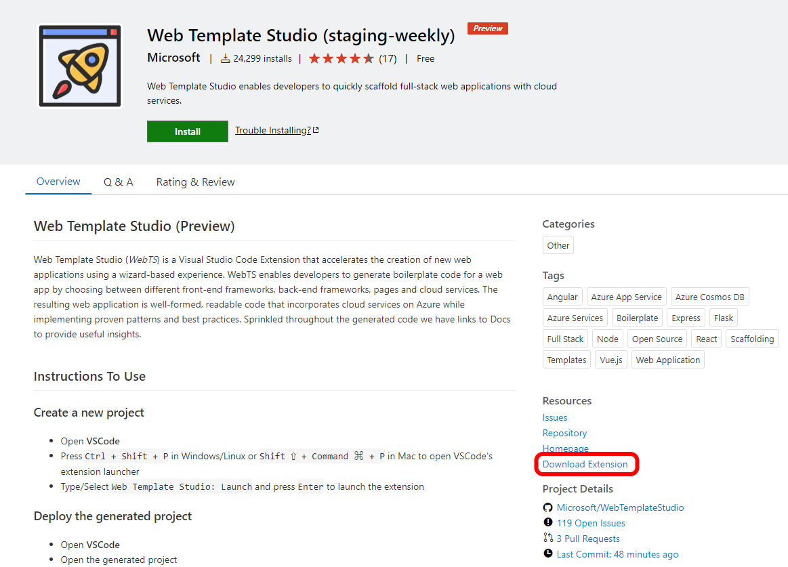
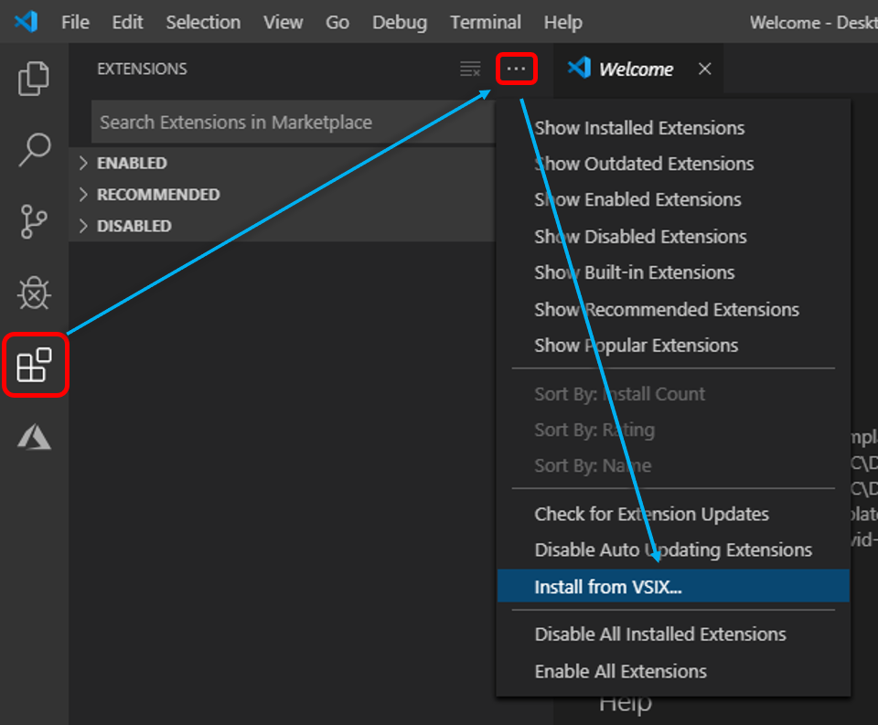

# Web Template Studio Installation Instructions

## Prerequisites

Web Template Studio runs as a VSCode extension and hence you'll need to have _VScode_ version 1.38 or above installed.
Also, you'll need [_Node_](https://nodejs.org/en/download/),[_Python_](https://www.python.org/downloads/) or [_ASP.NET_](https://dotnet.microsoft.com/download) and _npm_/[_yarn_](https://yarnpkg.com/en/docs/install) to run the generated templates.

## Where is the offical release?
We are currently early in our development phase and only have a dev nightly on Visual Studio Marketplace.

## Installing the nightly dev branch build _preferred_
Head over to [Visual Studio Marketplace’s Web Template Studio page](https://marketplace.visualstudio.com/items?itemName=WASTeamAccount.WebTemplateStudio-dev-nightly) and click "[install](vscode:extension/WASTeamAccount.WebTemplateStudio-dev-nightly)" 😊.  

## Installing the latest Microsoft Web Template Studio release manually

1. Head over to [Visual Studio Marketplace’s Web Template Studio page](https://marketplace.visualstudio.com/items?itemName=WASTeamAccount.WebTemplateStudio-dev-nightly)
2. In the right panel, section Resources, click on "Download Extension" and download the `.vsix` file
   

3. Open VSCode
4. Open the extensions menu from VSCode sidebar
5. Click on the ellipsis in the upper right hand corner
6. Choose _Install from VSIX_
7. Select the `.vsix` you downloaded earlier. Web Template Studio is now ready to use

#### Run the Release

- Open **VSCode**
- Press `ctrl+shift+p`to open VSCode's extension launcher
- Type/Select `Web Template Studio: Launch` and press `Enter` to launch the extension
