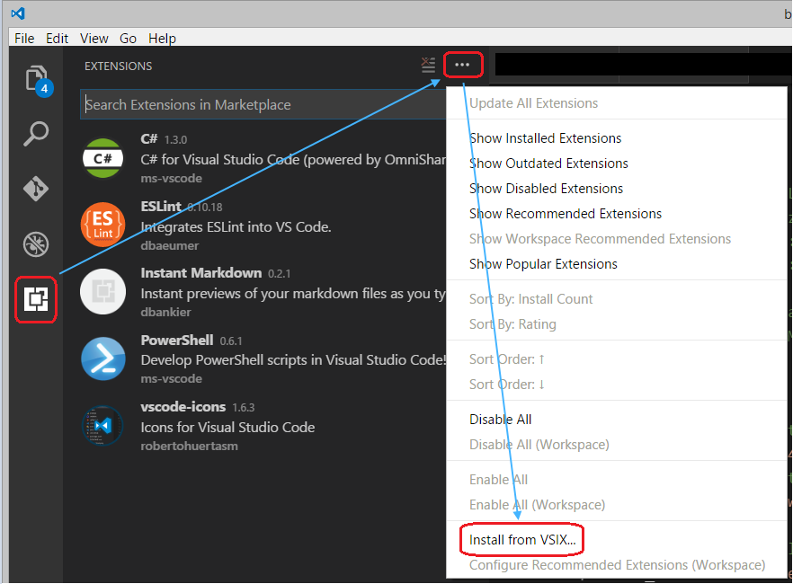

# Web Template Studio Installation Instructions

## Prerequisites

Web Template Studio runs as a VSCode extension and hence you'll need to have _VScode_ installed.
Also, you'll need _Node_ and _npm_/_yarn_ to run the generated templates.

## Installing the latest Microsoft Web Template Studio Release

1. Get the latest release from Web Template Studio [Github releases](https://github.com/Microsoft/WebTemplateStudio/releases)
2. Scroll down to _Assets_ and download the `.vsix` file
3. Open VSCode
4. Open the extensions menu from VSCode sidebar
5. Click on the ellipsis in the upper right hand corner
6. Choose _Install from VSIX_
7. Select the `.vsix` you downloaded earlier. Web Template Studio is now ready to use

#### Run the Release

- Open **VSCode**
- Press `ctrl+shift+p`to open VSCode's extension launcher
- Type/Select `Web Template Studio: Launch` and press `Enter` to launch the extension
