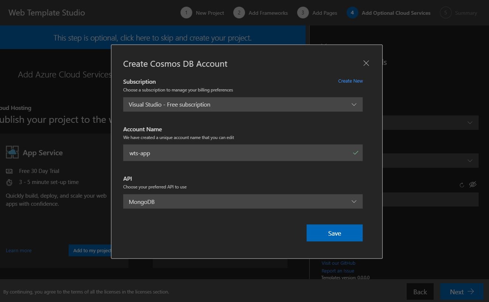
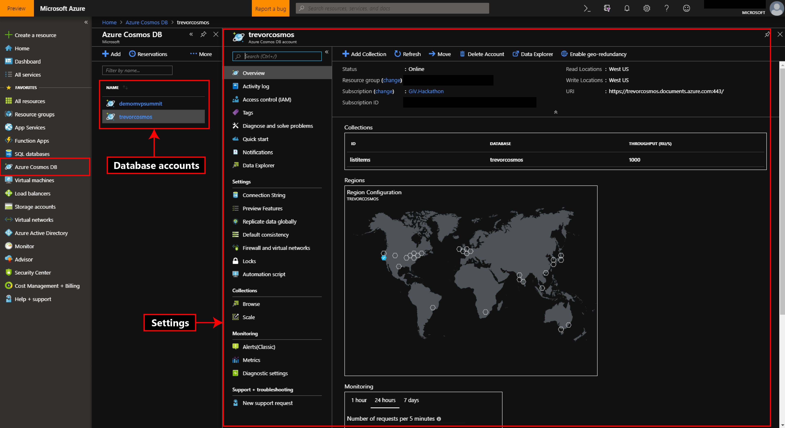
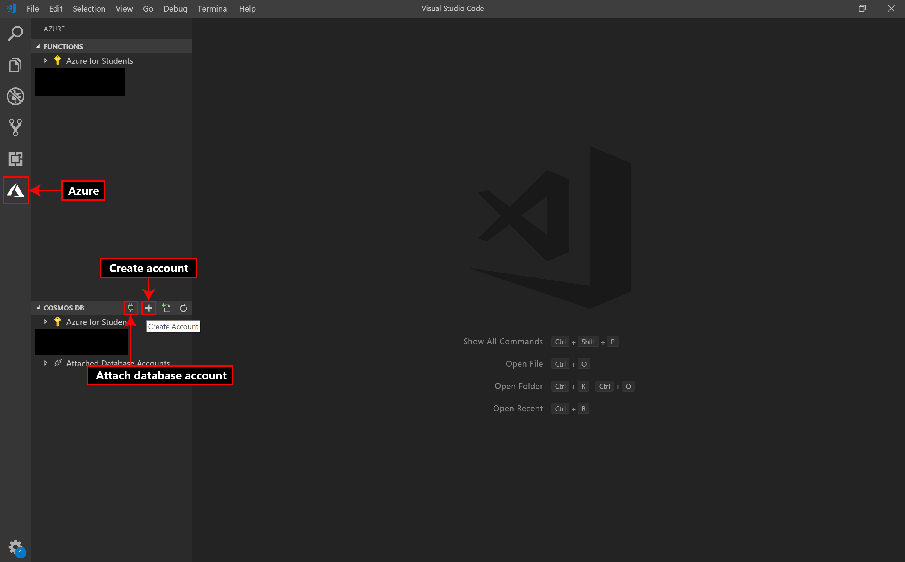

# Azure Cosmos DB

Azure Cosmos DB is Microsoft’s proprietary globally-distributed, multi-model database service for managing data on a
global scale. It offers a variety of APIs for your database including Azure Table, Core (SQL), MongoDB and Gremlin
(GraphQL). Web Template Studio offers you the functionality to deploy a Cosmos DB instance from the wizard itself
and select an initial location to deploy your database with the ability to scale it to multiple locations at a future
time. As an added feature, deploying with the MongoDB API enables you to quickly connect the project Web Template Studio
generates to your database instance.

## Getting started

To deploy Cosmos DB using Web Template Studio:

- Click _Add Resource_ on Cosmos DB under _Services_ tab

- Select a _Subscription_ and _Resource Group_ from the _Create Cosmos DB Account_ tab that just opened. Use _Create New_
  option if you want to create a new _Subscription_ or _Resource Group. _**Note:**\_ New subscription will take you to Azure portal to create a subscription.

- Enter a _Name_ for your cosmos account. This name is globally unique since your database will be available as
  `<cosmos_account_name>.documents.azure.com`.

- Select a _Location_ where your Cosmos DB instance will be deployed initially. You can scale it to multiple locations
  through the Azure portal after!

- Select an API for your database (Mongo/Core (SQL)/Azure Table/Cassandra/Gremlin (GraphQL) etc).

Once you hit generate on the summary page, Web Template Studio will deploy your database and display a popup with your
database connection string once it's available (usually within 5-6 minutes). This will prompt you to replace the
connection string in your _.env_ file with the new connection string. _**Note:**_ For advanced users, the _arm templates_
used to deploy your application are also available under the _arm-templates_ directory (in your generated project).

## Protecting Your Keys

Never make your API keys public or check in your API keys in to version control. The generated project stores API keys in the .env file. The .env file is excluded from version control in the `.gitignore`.

## How this works

Web Template Studio uses an arm-template for Cosmos (generated under the _arm-templates_ directory) to deploy
your Cosmos DB instance. This template contains the definitions and parameters for all resources and storage
accounts that need to be created for your database. Once Azure receives your template, it takes about 5-6 minutes to
assign VMs for your database account, get them up and running with your selected API and have the database connection
string available for you to connect to your database.

Once the connection string is available, Web Template Studio will prompt you to replace the variables in your _.env_ file
with this string and your keys. _**Warning:**_ Accepting this prompt will override your current _.env_. If you have made
any changes to this file, consider saving them! You will also need to restart your server to sync changes to your _.env_
file!

## Cosmos DB in Azure Portal

You can access and modify your database instance through the [Azure portal](https://portal.azure.com). Once you login to
the portal, select Azure Cosmos DB from the menu bar on the left side. This will list different database
accounts owned by you under different resource groups. Select the account you want to edit and it will bring up a menu
(_Settings_ in the image above) to configure your account. This can be anything from: scaling your database, adding new
collections, setting up firewalls, viewing metrics for your deployment etc.

## VSCode Extension for Azure Cosmos DB

If you would like to manage your Cosmos DB environment from VSCode itself, we recommend you install the
[Azure Cosmos](https://marketplace.visualstudio.com/items?itemName=ms-azuretools.vscode-cosmosdb) extension for VSCode.
Select Azure from the activity bar. From the Cosmos menu, you can create a new database account (as shown in the image
above) or attach a previously created database account. From here, you can create/view/edit/delete accounts, collections
and documents etc. or execute commands (such as SQL or mongo shell commands). Read the extension [documentation](https://
marketplace.visualstudio.com/items?itemName=ms-azuretools.vscode-cosmosdb)
for full features and usage!
