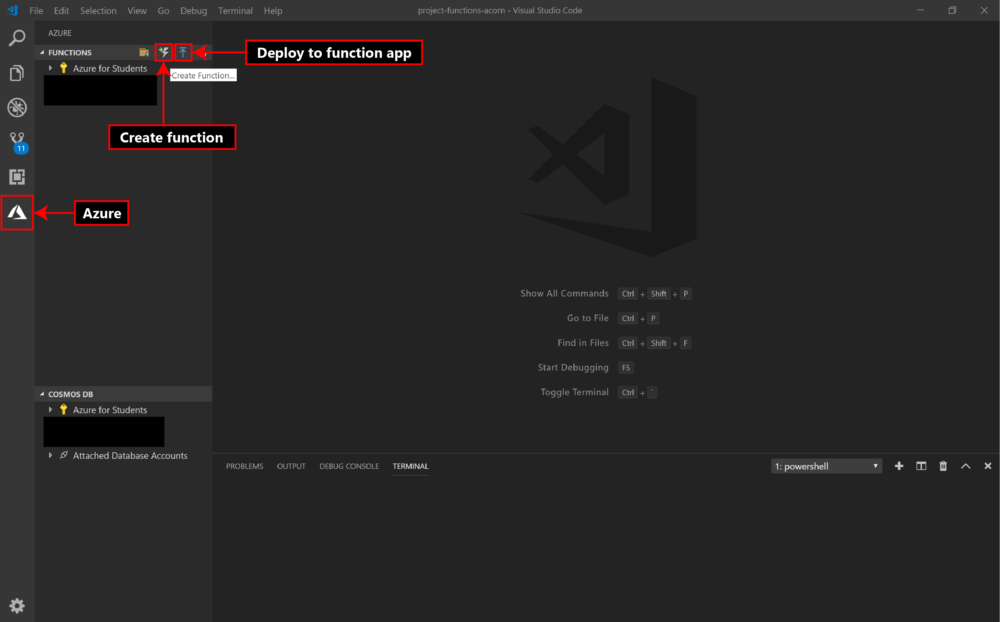

# Azure Functions

Azure Functions is a serverless compute service that enables you to run code on-demand without having to explicitly
provision or manage infrastructure. Think of it as deploying functions that run on pre-defined triggers instead of having
to write and manage a full-fledged server yourself. One of the most commonly used triggers is an HTTPTrigger which is
a function that runs whenever it receives an HTTP request (like an API endpoint). Project Acorn allows you to deploy
a function app with multiple 'hello world' HTTPTrigger functions (maximum of 10) so you can get to writing your business
logic as soon as possible!

## Getting started

To deploy an azure function application using Project Acorn:

- Click _Add Resource_ on Azure Functions under _services_ tab

- Select a subscription and resource group from the _Create functions application_ tab that just opened. Use _Create New_
  if you want to create a new subscription or resource group. _**Note:**_ New subscription would take you to Azure portal
  to create a subscription.

- Enter a name for your function app. This name has to be globally unique since your app will be available as
  `<function_app_name>.azurewebsites.net` after.

- Select a location where your function app will be deployed. You want it to be closer to your users (or servers if it's
  running as a back-end service helper)

- Select a runtime for your functions. This is basically what programming language/framework you want to write your
  functions in.

- Select number of functions you think you might need for your applications. Think about this as number of endpoints you
  think your application would need. You can rename your functions from the summary bar on the right side of the
  application. These would be available as `<function_app_name>.azurewebsites.net\api\<function_name>`

The _hello world_ functions deployed are pretty basic and just return _Hello, <name>_ on a query/header with variable
name. For ex: `<function_app_name>.azurewebsites.net\api\<function_name>?name=John+Doe` will return _Hello, John Doe_.

## How this works

Once you hit generate, Project acorn creates a directory with the same name as your _function app name_ under your
generated project. This is compressed to a _.zip_ and deployed (using kudu zip deploy) to your newly created function
application. \__**Note:**_ For advanced users, the _arm templates_ used to deploy your application are also available
under _arm-templates_ directory (under your generated project).

## Functions app in Azure Portal

You can configure your functions application for advanced settings (like configuring domain, storage accounts etc.),
delete your application etc. from your [azure portal](https://portal.azure.com). Once you login to the portal, select
functions app from the menu bar on left side and select your application. Your individual functions are listed under
_functions_ and you can monitor them/integrate them here. Pretty much anything you need to manage about your application
can be done through the portal.

## Editing your functions and deploying the changes

We strongly encourage you to install the [Azure Functions](https://marketplace.visualstudio.com/items?itemName=ms-azuretools.vscode-azurefunctions) extension for VSCode by _Microsoft_ to manage your application. This enables
you to deploy your changes with a single click and test them out right away instead of manually deploying the new changes.
Once you have installed this application, here's what you need to do to deploy your changes:

- Open your functions application directory in a new VSCode window. Edit your function/functions file.

- Select Azure from the activity bar on VSCode and under the functions tab bar, click the `Deploy to function app...`
  button and select your function application from the menu.

- You can also add new functions using the `Create function...` button.

- To remove a function, simply delete the corresponding files, delete all references to it and deploy again.

### Deploying manually

If you don't want to install the extension (it is _recommended_ that you install it to make your workflow easier), follow
one of the ways mentioned in the [Azure app service zip deploy tutorial](https://docs.microsoft.com/en-us/azure/app-service/deploy-zip) to manually deploy your updated functions!
