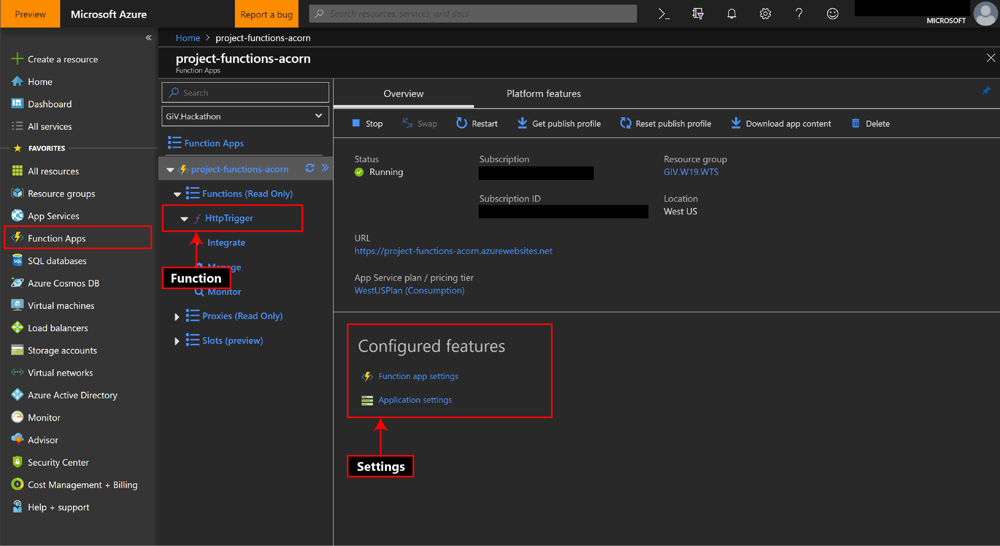

# Azure Functions

Azure Functions is a serverless compute service that enables you to run code on-demand without having to explicitly
provision or manage infrastructure. Think of it as deploying functions that executes on pre-defined triggers instead of
having to write and manage a full-fledged server yourself. One of the most commonly used triggers is an HTTPTrigger which
is a function that runs whenever it receives an HTTP request. This is essentially the same as an API endpoint. Web
Template Studio allows you to deploy a function app with multiple 'hello world' HTTPTrigger functions (maximum of 10) so
you can get to writing your business logic as soon as possible!

## Getting started

Deploying an Azure Function application using Web Template Studio:


- Click _Add Resource_ on Azure Functions under _Services_ tab

- Select a _Subscription_ and _Resource Group_ from the _Create Functions Application_ tab that just opened. Use _Create
  New_ if you want to create a new subscription or resource group. _**Note:**_ New subscription will take you to the Azure
  portal to create a subscription.

- Enter an _App Name_ for your function app. This name has to be globally unique since your app will be available as
  `<function_app_name>.azurewebsites.net`.

- Select a _Location_ where your function app will be deployed. You want it to be closer to your users (or servers if it's
  running as a back-end service helper).

- Select a _Runtime_ for your functions. This is the programming language/framework you want to write your
  functions in.

- Select the _Number of Functions_ needed for your application. This number can be thought of as the number of endpoints
  your application would need. You can rename your functions from the summary bar on the right side of the
  application. These would be available as `<function_app_name>.azurewebsites.net/api/<function_name>`.

The _hello world_ functions deployed are pretty basic and just return _"Hello, `<name>`"_ on a query/header with the
variable 'name'. For example: `<function_app_name>.azurewebsites.net/api/<function_name>?name=John+Doe` will return
_"Hello, John Doe"_.

## How this works

Once you hit generate, Web Template Studio creates a directory with the same name as your Function's _App Name_ under your
generated project. This is compressed to a _.zip_ and deployed (using kudu zip deploy) to your newly created function
application. _**Note:**_ For advanced users, the _arm templates_ used to deploy your application are also available
under the _arm-templates_ directory (inside your generated project).

## Calling your function

Since all functions deployed through Web Template Studio are HTTP Triggers, you can invoke a function with an HTTP request.
You can use your favorite HTTP Client library (for example Axios, Fetch, Request etc.) to hit the endpoints exposed
by your function application. An individual function (assume it's called `function1`) under an application with _appName_
`my-functions-app` is available at `my-functions-app.azurewebsites.net/api/function1`.

### Examples

Let's assume we have a Hello World function application with appName `my-functions-app` and a function `function1` that returns _"Hello,
`<name>`"_ on a query/header with the variable 'name'

- Using Fetch with Javascript:

```js
fetch(
  "https://`my-functions-app.azurewebsites.net/api/function1?name=John+Doe",
  {
    method: "GET"
  }
)
  .then(res => {
    //  this would print `Hello John Doe`
    console.log(res);
  })
  .catch(err => {
    console.error(err);
  });
```

- Using Axios with Javascript

```js
axios
  .get(
    "https://`my-functions-app.azurewebsites.net/api/function1?name=John+Doe"
  )
  .then(res => {
    //  this would print `Hello John Doe`
    console.log(res);
  })
  .catch(err => {
    console.error(err);
  });
```

## Functions app in Azure Portal



You can configure your Function Application's advanced settings (like configuring a domain, storage accounts,
delete your application etc.) from the [azure portal](https://portal.azure.com). Once you login to the portal, select
**Function Apps** from the menu bar on the left side and select your application. Your individual functions are listed
under _Functions_ and you can monitor/integrate them here. Everything you need to manage/configure about your Function
Application can be done through the portal.

## Editing your functions and deploying the changes

We strongly encourage you to install the [Azure Functions](https://marketplace.visualstudio.com/items?
itemName=ms-azuretools.vscode-azurefunctions) extension for VSCode by **Microsoft** to manage your application. This
enables you to deploy your changes with a single click and test them out immediately instead of manually deploying the
new changes. Once you have installed this extension, here's what you need to do to deploy your changes:


- Open your Function Application's directory in a new VSCode window. Edit your function file(s).

- Select Azure from the activity bar on VSCode and in the _Functions_ tab bar, click the `Deploy to function app...`
  button and select your function application from the menu.

- You can also add new functions using the `Create function...` button.

- To remove a function, simply delete the corresponding files and all references to it and deploy again.

### Deploying manually

If you do not want to install the extension (it is _recommended_ that you install it to make your workflow easier), follow
one of the methods in the [Azure app service zip deploy tutorial](https://docs.microsoft.com/en-us/azure/app-service/deploy-zip) to manually deploy your updated functions!
