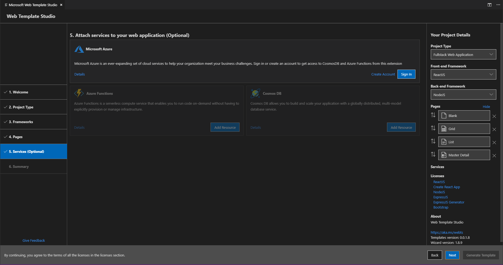

# Web Template Studio (Preview)

Web Template Studio (_WebTS_) is a Visual Studio Code Extension that accelerates the creation of new Web apps using a
wizard-based experience. WebTS enables developers to generate boiler plate code for a web application
by choosing betweeen different front-end frameworks, back-end frameworks, pages and cloud services.
The resulting Web application is well-formed, readable code that incorporates cloud services on
Azure while implementing proven patterns and best practices. Sprinkled throughout the generated code we have links to
Docs to provide useful insights.

## Instruction To Use

- Open **VSCode**
- Press `ctrl+shift+p` in Windows/Linux or `⇧⌘P` in Mac to open VSCode's extension launcher
- Type/Select `Web Template Studio: Launch` and press `Enter` to launch the extension

## Build Status

| Branch  |                                                                                                                                           Build Status                                                                                                                                            |
| :------ | :-----------------------------------------------------------------------------------------------------------------------------------------------------------------------------------------------------------------------------------------------------------------------------------------------: |
| dev     |          |
| staging |  |
| master  |    |

## Example Scenario

I need a full-stack web app that stores data in a Cosmos database.

## Features

Web Template Studio approaches web app creation using the following four attribute sets:

- **Project type**: First, what type of application are you building? We currently support only one type: _Fullstack Application_.
- **Frameworks**: Next, which frameworks do you want to use for your frontend and backend? We currently support one framework for frontend: _[React.js](https://reactjs.org/)_ and one framework for backend: _[Node.js](https://nodejs.org/en/)_.
- **App pages**: To accelerate app creation, we provide a number of app page templates that you can use to add common UI pages into your new app. The current page templates include: _blank page_, common layouts (*e.g., master detail) and pages that implement common patterns (*e.g., grid, list). Using the wizard, add as many of the pages as you need, providing a name for each one, and we'll generate them for you.
- **Cloud Services**: Lastly, you specify which Azure cloud services you want to use, and we'll build out the framework for the services into your app including tagging 'TODO' items. Currently supported services cover storage (_Azure Cosmos DB_), and compute (_Azure Functions_).

Once you make the selections you want and click generate, you can quickly extend the generated code.

## Feedback, Requests and Roadmap

Please use [GitHub issues](https://github.com/Microsoft/WebTemplateStudio/issues) for feedback, questions or comments.

If you have specific feature requests or would like to vote on what others are recommending, please go to the [GitHub issues](https://github.com/Microsoft/WebTemplateStudio/issues) section as well. We would love to hear your thoughts.

We are still extremely early in development and are looking for feedback for roadmap. Currently we are in the process of stabilizing our React / Node.js golden path.

## Contributing

Do you want to contribute? We would love to have you help out. Here are our [contribution guidelines](CONTRIBUTING.md).

## License

This code is distributed under the terms and conditions of the [MIT license](LICENSE.md).

# Privacy Statement

The extension does [log basic telemetry](docs/telemetry.md) for what is being selected. We are in the process of creating a [Telemetry Data](docs/telemetryData.md) page to summarize usage trends. Please read the [Microsoft privacy statement](http://go.microsoft.com/fwlink/?LinkId=521839) for more information.
